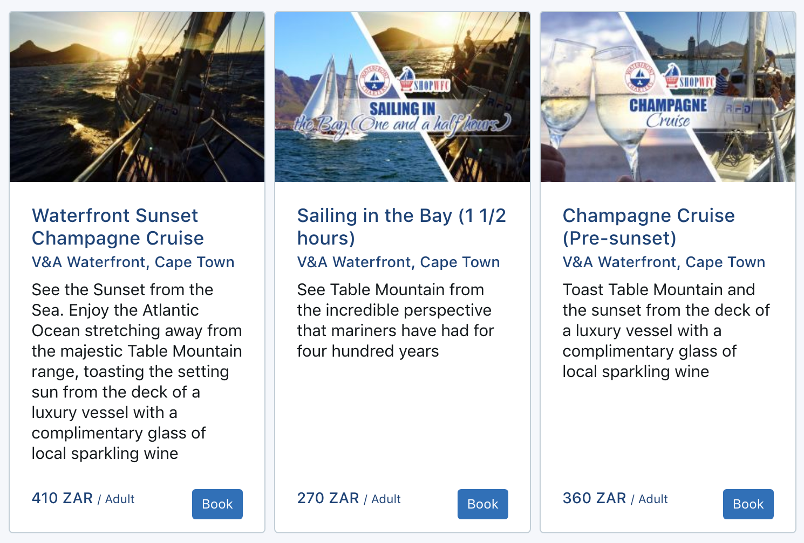

# Autoura API

**This is a PROVISIONAL document outlining some example methods of the Autoura API**

Any questions please email devhelp@autoura.com

### Authentication

You should have an API key which needs to be set in an Authorization header, preceded with Bearer and a space.

    Authorization: Bearer API_KEY
    
In Axios, we would set something like

    config.headers.Authorization = 'Bearer API_KEY'
    
The API key is expected to be used within mobile apps and other client side code (e.g. JavaScript). There is no method to access customer details or other GDPR related information with this API key.  

You can test that you are correctly authorising by calling the WhoAmI endpoint

    https://api.autoura.com/api/whoami
        
Other APIs may be cached hence may appear they work. The WhoAmI endpoint is not cached so will be a true test for your connection.
        
### Stops & Routes

Autoura is designed around autonomous vehicle sightseeing and other modes of transport (bike / scooter / walking etc)

Individual "things to do" are stops on a route. A stop is the base unit that can be bookable, or can be something to visit (e.g. a point of interest). 

There are 6 top level stop types:

* Food
* Hotel & Accommodation
* Point / Place of interest (POI)
* Attraction
* Ticket & Event
* Tour & Activity
     
### Stop

To check that you are able to connect to the API, a good first test that you have got the API working is to get the details of a stop. [Test stop]

    https://api.autoura.com/api/stops/get?stop_id=food-923a9f975568271

All API responses have at the top level a _success_ response. You can check that the success response exists / is true, in order to use the data within the response.

An example REAL stop

    https://api.autoura.com/api/stops/get?stop_id=tour-3379ef80eab8054

You should be able to see that you request using stop_id with the stop id....... but where do you get the stop_id from? 

### Search

Searching is the key method to find a stop_id

e.g

    https://api.autoura.com/api/stops/search?group_context=friends&stop_types=tour

That will come up with a list of tours. 

Stop types are:

* accom
* food
* event
* poi
* attraction
* tour

e.g. to search for food: 

    https://api.autoura.com/api/stops/search?group_context=friends&stop_types=food

We have a lot of food things in London.

#### Geocode search

Search by lat / lng

    https://api.autoura.com/api/stops/search?stop_types=tour&geocode_lat=-33.9249&geocode_lng=18.4241

You can also add geocode_distance - for distance in km

#### Date search

To search a specific date

    &date=2019-02-01 

To search a range of dates

    &date_start=2019-02-01&date_end=2019-03-01 

To search a specific time (24 hour clock, local time)

    &time=10:00

or we can do a wider time search - will include things ABOUT to open

    &time_wide=10:00

or a time range

    &time_start=10:00&time_end=13:00

For example, if you want to search for things open in the evening

    &time_start=17:30&time_end=23:00

**Think of this as 3 modes. No date. Date. Date & time. i.e. to search by time, you must also search by date (or date range)**

#### Group context

group_context can be:

* solo
* couple
* friends (default)
* kids
* teenagers
* group
* party

For example if you search using group_context kids, alcohol experiences will not be shown

### Images

Images are served using Cloudinary.

You can find out more about how to use the image APIs here. Plenty of opportunity for a lot of interesting effects etc with images

https://cloudinary.com/documentation/image_transformation_reference

Or just serve picture/url response field

### Creating a card design

This is a very rough Vue / Bootstrap example but should give you a feel as to how to create a nice card like this:

      

        <template v-for="(search_row,index) in **** SEARCH RESULTS ****">

          

            

              <!-- INSERT IMAGE -->
              

                <h5 class="mb-1">{{search_row.name}}</h5>
                <h6>{{search_row.location.name}}</h6>
                
{{search_row.summary}}

              

              

                <button class="float-right btn btn-primary ml-2 btn-sm">Book</button>

                <h6>from {{search_row.price_retail.from_price}} {{search_row.price_retail.currency}} / {{search_row.price_retail.rate_label}}</h6>
              

            

          

        </template>
      

## Good data

Good data for things do do can be found in London (food) and Cape Town (tours).